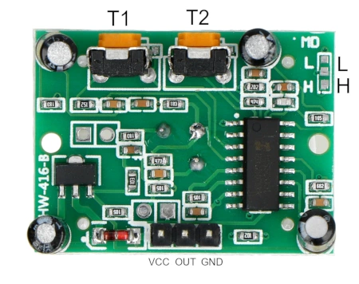

# rpi_sensors

Board RPI PI pico W
[micropython](https://micropython.org/download/RPI_PICO_W/)
sensor used: PIR HC-SR501 
## PIR HC-SR501 

Wykrycie obiektu, w polu widzenia czujnika, sygnalizowane jest stanem wysokim pojawiającym się na wyprowadzeniu OUT. 

T1 - czas trwania stanu wysokiego po wykryciu obiektu <- I turned it down as much as possible (to the left ), since I measure sensor state every 0.1 second

T2 - czułość czujnika (dystans, w którym wykrywa ruch obiektu)

